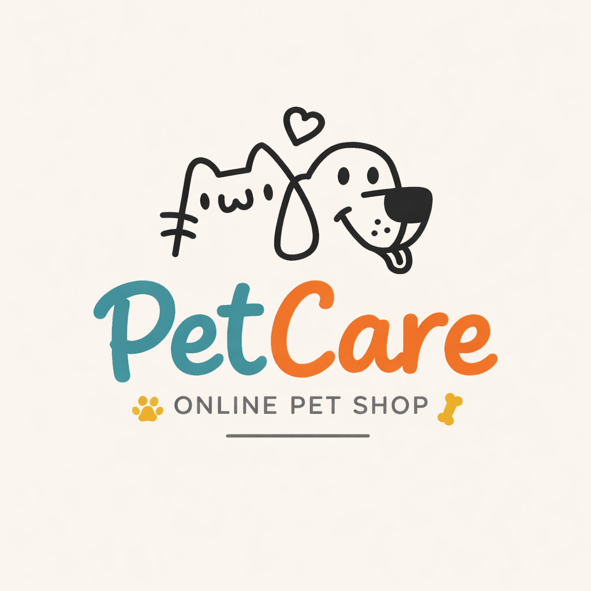

# 🐾 PetCare

## 🌟 Overview
PetCare is a web platform designed for pet owners, future pet owners, and anyone interested in animal care.

It combines an online pet shop with animal adoption features, helping users take better care of pets and support shelters.

---

## 🚀 Features
- 🛒 Online pet shop (food, toys, medical supplies)
- 🐶 Animal shelters and adoptable pets
- 📚 Pet care tips and guidance
- 🔐 User authentication (login/logout)

---

## 🛠 Tech Stack
- **Frontend:** Angular  
- **Backend:** Django + Django REST Framework  
- **Database:** SQLite (or PostgreSQL)  
- **Version Control:** GitHub  

---

## 👥 Team Members
- Ajibayeva Adeliya  
- Abutalifuly Eraly  
- Meirambek Zhalgasbek  

---

## 🔮 Future Improvements
- ❤️ Favorite animals feature  
- 🔍 Advanced search and filters  
- 📦 Order tracking system  
- 📱 Mobile-friendly design  

---

## 📌 Status
🚧 Project in development

---
